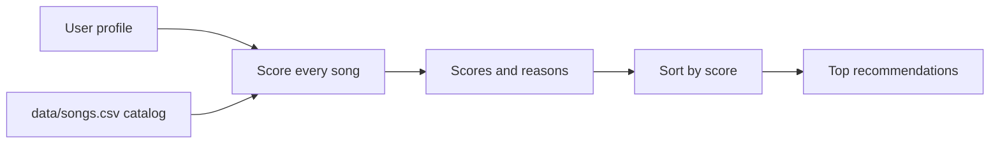

# Music Recommender Simulation

## Project Summary

This project is a small content-based music recommender. It compares a user's taste profile to a CSV catalog of fictional songs, gives every song a score, and returns the highest-ranked matches with plain-language reasons.

Real platforms such as Spotify, YouTube, and TikTok use many signals at once. Collaborative filtering looks at patterns from many users, such as likes, skips, replays, follows, and playlists. Content-based filtering looks at the item itself, such as genre, mood, tempo, energy, or tags. This simulator focuses on the content-based part so the scoring logic is easy to inspect.

## How The System Works

Each song uses these features:

- `genre`
- `mood`
- `energy`
- `tempo_bpm`
- `valence`
- `danceability`
- `acousticness`

Each user profile can include:

- `genre`
- `mood`
- `energy`
- `valence`
- `danceability`
- `likes_acoustic`

The recommender scores every song, sorts the results from highest to lowest score, and returns the top songs. Exact genre and mood matches add fixed points. Numeric features use closeness scoring, so a song near the user's target energy earns more than a song far away.



### Algorithm Recipe

`balanced` mode:

- Genre match: `+2.0`
- Mood match: `+1.5`
- Energy closeness: `max(0, 1 - abs(song_energy - target_energy)) * 2.0`
- Optional valence closeness: multiplier `1.0`
- Optional danceability closeness: multiplier `1.0`
- Acoustic preference: rewards high acousticness if `likes_acoustic` is true; lightly rewards low acousticness if false

`genre_first` mode:

- Genre match: `+3.0`
- Mood match: `+1.0`
- Energy closeness multiplier: `1.0`

`mood_first` mode:

- Genre match: `+1.0`
- Mood match: `+3.0`
- Energy closeness multiplier: `1.5`

The different modes show how small weight changes can shift the ranked list even when the same songs and user profile are used.

## Getting Started

### Setup

Create a virtual environment if you want an isolated install:

```bash
python3 -m venv .venv
source .venv/bin/activate
```

Install dependencies:

```bash
python3 -m pip install -r requirements.txt
```

Run the app:

```bash
python3 -m src.main
```

Run tests:

```bash
python3 -m pytest -q
```

## Experiments Tried

The CLI runs three taste profiles:

- High-Energy Pop: pop, happy, high energy, high danceability, low acousticness
- Chill Acoustic Focus: lofi, chill, low energy, medium valence, high acousticness
- Deep Intense Rock: rock, intense, high energy, low acousticness

Representative output:

```text
Loaded songs: 18

Profile: High-Energy Pop
Mode: balanced
1. Sunrise City by Neon Echo (pop, happy)
   Score: 6.79
   Because: genre match (+2.00); mood match (+1.50); energy closeness (+1.94); danceability closeness (+0.94); low-acoustic preference (+0.41)
```

In `genre_first` mode, exact genre matches get a stronger boost. In `mood_first` mode, songs with the same mood can move upward even if they are not the same genre. This makes the system useful for testing how recommendation weights change outcomes.

## Limitations and Risks

The catalog has only 18 songs, so the recommender cannot represent the full range of music taste. It uses hand-written weights instead of learning from real behavior. It can also create filter bubbles because exact genre and mood labels can dominate the score. A real product would need more data, diversity checks, and feedback from skips, replays, saves, and long-term listening history.

## Reflection

This project showed how a simple scoring rule can still feel like a recommendation system. The results are easy to explain because each score comes with reasons, but the simplicity also exposes the limits. A song can rank highly because it matches a label, not because it would truly fit a person's taste.

The biggest lesson is that recommendation systems are shaped by design choices. Changing one weight can make the output feel more personal, more repetitive, or more biased. Human judgment still matters because the model only knows the features it is given.

Read the completed model card for more detail: [model_card.md](model_card.md).
