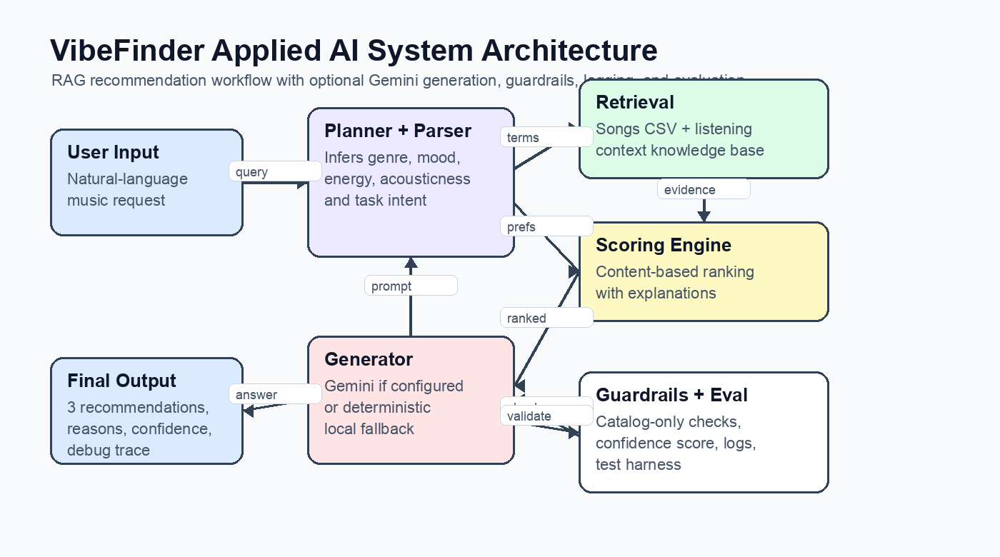

# VibeFinder Applied AI System

VibeFinder is a retrieval-augmented AI music recommendation assistant. A user asks for music in natural language, the system retrieves relevant catalog songs and listening-context guidance, scores the songs with an explainable recommender, and then generates a grounded response with guardrails and confidence reporting.

## Original Project

This project extends my Module 3 project, **Music Recommender Simulation**. The original version was a content-based recommender that loaded a small fictional song catalog from `data/songs.csv`, scored songs against a structured user profile, and explained each ranking with genre, mood, energy, danceability, valence, and acousticness signals. It was useful for showing how recommendation weights affect results, but it did not understand natural-language requests or retrieve contextual evidence before answering.

## What Changed

The final version turns the recommender into an applied AI system with:

- **RAG retrieval** over `data/songs.csv` and `data/listening_contexts.csv`
- **Agentic workflow steps**: parse request, retrieve evidence, score songs, generate answer, validate output
- **Gemini integration** through `GEMINI_API_KEY`
- **Deterministic fallback generation** so tests and demos still run without an API key
- **Guardrails** that check whether the answer names scored recommendations and includes enough explanation
- **Reliability harness** that runs predefined cases and prints pass/fail plus confidence
- **Logging** to `logs/system.log`

## Architecture



The user enters a natural-language request. The parser infers preferences such as genre, mood, target energy, danceability, and acoustic preference. The retriever searches both the song catalog and a small custom listening-context knowledge base. The scoring engine ranks songs with explainable content-based logic. The generator uses Gemini when configured, otherwise it uses a deterministic local response. Guardrails validate the answer and the evaluation script tests expected behavior.

## Project Structure

```text
.
├── assets/system_architecture.png
├── data/listening_contexts.csv
├── data/songs.csv
├── src/ai_client.py
├── src/evaluate.py
├── src/main.py
├── src/rag_system.py
├── src/recommender.py
├── tests/test_rag_system.py
├── tests/test_recommender.py
├── model_card.md
└── requirements.txt
```

## Setup

Create and activate a virtual environment:

```bash
python3 -m venv .venv
source .venv/bin/activate
```

Install dependencies:

```bash
python -m pip install -r requirements.txt
```

Optional Gemini setup:

```bash
cp .env.example .env
# Edit .env so it contains:
# GEMINI_API_KEY=your_key_here
```

The app automatically reads `GEMINI_API_KEY` from `.env` or from your exported shell environment. Do not commit `.env` or paste the real key into source code. The app works without Gemini by using the local fallback generator.

## Run The System

Run a RAG recommendation:

```bash
python -m src.main --query "Give me high energy pop songs for a workout."
```

Force reproducible local output without Gemini:

```bash
python -m src.main --query "I need calm lofi music for coding and deep study." --no-gemini --debug
```

Run the original Module 3 scoring demo:

```bash
python -m src.main --original-demo
```

Run tests:

```bash
python -m pytest -q
```

Run the reliability harness:

```bash
python -m src.evaluate
```

## Sample Interactions

### Example 1: Workout request

Input:

```text
Give me high energy pop songs for a workout.
```

Output summary:

```text
Provider: local_fallback
Guardrails: PASS (confidence 1.00)

1. Gym Hero by Max Pulse - score 5.88
2. Sunrise City by Neon Echo - score 4.29
3. Storm Runner by Voltline - score 3.89
```

The system retrieved the **Workout sprint** context and used it to infer high energy, pop, intense mood, and low acoustic preference.

### Example 2: Study request

Input:

```text
I need calm lofi music for coding and deep study.
```

Output summary:

```text
Provider: local_fallback
Guardrails: PASS (confidence 1.00)

1. Midnight Coding by LoRoom
2. Library Rain by Paper Lanterns
3. Focus Flow by LoRoom
```

The parser treats coding/study intent as a focus signal, so it chooses moderate-low energy rather than only using the word "calm."

### Example 3: Evening request

Input:

```text
Recommend gentle acoustic music for a calm evening.
```

Output summary:

```text
Provider: local_fallback
Guardrails: PASS (confidence 1.00)

1. Golden Porch by Maya Fields
2. Spacewalk Thoughts by Orbit Bloom
3. Library Rain by Paper Lanterns
```

The answer is grounded in the small catalog, so it includes a limitation note instead of pretending to know every possible artist or song.

## Design Decisions

I kept the original recommender as the ranking core because its scoring is transparent and testable. RAG is added around that core rather than replacing it, so retrieved context affects inferred preferences and answer generation while the ranking still remains explainable.

Gemini is optional because a portfolio evaluator should be able to run the project without owning my API key. When `GEMINI_API_KEY` is present, Gemini receives a prompt containing only retrieved evidence and scored recommendations. When it is absent or fails, the local fallback produces the same style of grounded answer.

The retrieval layer uses lightweight keyword overlap instead of embeddings. That trade-off keeps setup simple and reproducible for a small CSV-based project, but it would not scale to a large music library or ambiguous language.

## Reliability And Testing Summary

Automated tests cover the original recommender and the new RAG workflow:

```text
12 passed
```

The evaluation harness currently reports:

```text
Summary: 3 out of 3 cases passed.
```

What worked: workout, study, and calm evening requests returned expected catalog songs with passing guardrails. What needed adjustment: an early version treated "calm lofi music for coding" as only a relaxation request; a test caught this, and the parser now gives explicit study/coding intent higher priority.

## Limitations And Ethics

The dataset is fictional and very small, so the system can over-represent genres that have more examples and under-represent genres with only one song. The keyword retriever can also miss intent if the user phrases a request in a way the system does not recognize.

Potential misuse is low because the app recommends fictional music, but the same pattern could become risky if used for real user profiling without consent. To reduce that risk, this project does not store personal user histories, keeps logs limited to system behavior, and explains when recommendations are based only on limited catalog evidence.

## Reflection

This project taught me that a useful AI system is more than a model call. The important work was connecting retrieval, deterministic logic, generation, validation, and testing into one repeatable workflow.

AI collaboration helped most when brainstorming how to structure the system as a RAG pipeline around the original recommender. A flawed suggestion was to rely too much on generated text as proof of quality; the better solution was to add concrete tests and an evaluation harness that can fail when behavior is wrong.


